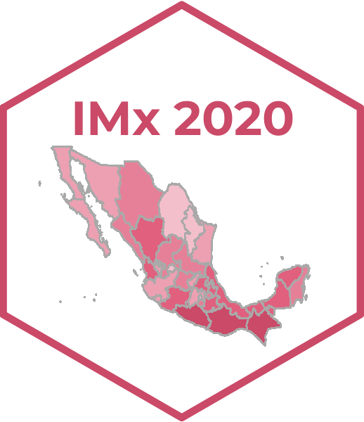

<!-- README.md is generated from README.Rmd. Please edit that file -->

<h1 style="color:#B6854D; font-family: "Montserrat"; font-size: 28px;"> Indice de marginación 2020</h1> 

<!-- badges: start -->

<!-- badges: end -->

El Consejo Nacional de Población (`CONAPO`) ha dado un paso significativo en el perfeccionamiento de esta métrica, adoptando una nueva metodología conocida como Distancias Ponderadas al Cuadrado (DP2) en lugar de la técnica anterior de Análisis de Componentes Principales (ACP).   

    El índice de marginación es una herramienta crucial que nos permite identificar y medir el nivel de vulnerabilidad y desigualdad en distintas áreas geográficas del país. Al combinar diversos indicadores socioeconómicos, como acceso a servicios básicos, educación, empleo y calidad de vida, nos proporciona una visión completa de la realidad que enfrentan las comunidades en México.

<!-- Anotaciones: start -->

<h2 style="color:#B6854D; font-family: "Montserrat"; font-size: 26px;"> 📋 Conjunto de datos </h2>

<!-- Anotaciones: end -->

-   [Índice de marginación por entidad federativa,
    2020](https://github.com/IndiceMx/IM_2020/blob/main/IME_2020.xlsx)  
-   [Índice de marginación por municipio,
    2020](https://github.com/IndiceMx/IM_2020/blob/main/IMM_2020.xlsx)  
-   [Índice de marginación por localidad,
    2020](https://github.com/IndiceMx/IM_2020/blob/main/IML_2020.xlsx)
-   [Índice de marginación urbana por AGEB,
    2020](https://github.com/IndiceMx/IM_2020/blob/main/IMU_2020.xlsx)
-   [Índice de marginación urbana por colonia,
    2020](https://github.com/IndiceMx/IM_2020/blob/main/IMUC_2020.xlsx)

### 📌 [Datos abiertos](https://datos.gob.mx/)

https://user-images.githubusercontent.com/105407540/168457836-606c4a25-fb58-4dd4-987f-3f8427e6b4a5.mp4
 

<h3 style="color:#B6854D; font-family: "Montserrat"; font-size: 24px;">  Metadatos </h3>

<table class="table table-condensed table-hover lightable-classic" style="font-size: 10px; margin-left: auto; margin-right: auto; font-family: montserrat; width: auto !important; margin-left: auto; margin-right: auto;">
<thead>
<tr>
<th style="text-align:left;font-weight: bold;color: black !important;">
Campo
</th>
<th style="text-align:left;font-weight: bold;color: black !important;">
Valor
</th>
</tr>
</thead>
<tbody>
<tr>
<td style="text-align:left;font-weight: bold;color: black !important;">
Fuente
</td>
<td style="text-align:left;text-decoration: underline;">
<a href="https://www.gob.mx/conapo"> www.gob.mx/conapo </a>
</td>
</tr>
<tr>
<td style="text-align:left;font-weight: bold;color: black !important;">
Frecuencia
</td>
<td style="text-align:left;">
<a href=""> R/P5Y </a>
</td>
</tr>
<tr>
<td style="text-align:left;font-weight: bold;color: black !important;">
GUID
</td>
<td style="text-align:left;">
<a href=""> Índice de marginación (carencias poblacionales) por
localidad, municipio y entidad </a>
</td>
</tr>
<tr>
<td style="text-align:left;font-weight: bold;color: black !important;">
Idioma
</td>
<td style="text-align:left;">
<a href=""> es </a>
</td>
</tr>
<tr>
<td style="text-align:left;font-weight: bold;color: black !important;">
Modificado
</td>
<td style="text-align:left;">
<a href=""> 2021-09-29T00:00:00Z </a>
</td>
</tr>
<tr>
<td style="text-align:left;font-weight: bold;color: black !important;">
Nombre del publicador
</td>
<td style="text-align:left;">
<a href=""> CONAPO </a>
</td>
</tr>
<tr>
<td style="text-align:left;font-weight: bold;color: black !important;">
Publicado
</td>
<td style="text-align:left;">
<a href=""> 2017-06-06T22:31:26Z </a>
</td>
</tr>
<tr>
<td style="text-align:left;font-weight: bold;color: black !important;">
Tema
</td>
<td style="text-align:left;">
<a href=""> Desarrollo </a>
</td>
</tr>
<tr>
<td style="text-align:left;font-weight: bold;color: black !important;">
Tipo del publicador
</td>
<td style="text-align:left;">
<a href=""> Director de Poblamiento y Desarrollo Regional Sustentable
</a>
</td>
</tr>
<tr>
<td style="text-align:left;font-weight: bold;color: black !important;">
Diccionario de Datos
</td>
<td style="text-align:left;text-decoration: underline;">
<a href="https://www.gob.mx/conapo/documentos/diccionarios-de-las-bases-de-datos-de-marginacion?idiom=es">
Consulta </a>
</td>
</tr>
</tbody>
</table>

<h4>  Etiquetas </h4>

<code> <b>marginación</b></code> <code> <b>población</b> </code> <code><b>carencias</b></code> <code><b>desarrollo sostenible</b></code> <code><b>economia</b></code> <code><b>estimaciones</b></code> <code><b>índice</b> </code> <code><b>conapo</b> </code>
